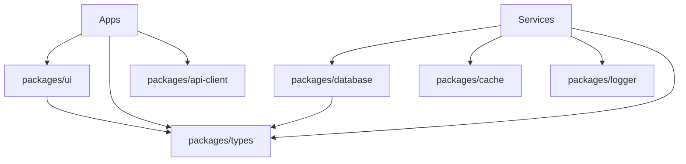

# Project Structure

Skillancer uses a monorepo architecture managed by **Turborepo** with **pnpm workspaces**. This structure enables code sharing, consistent tooling, and efficient CI/CD.

## Top-Level Structure

```
skillancer/
├── apps/                 # Frontend applications
├── services/             # Backend microservices
├── packages/             # Shared libraries
├── infrastructure/       # Infrastructure as Code
├── docs/                 # Documentation (you are here!)
├── scripts/              # Development & deployment scripts
├── plop-templates/       # Code generation templates
│
├── package.json          # Root workspace config
├── pnpm-workspace.yaml   # Workspace definitions
├── turbo.json            # Turborepo configuration
├── Makefile              # Common commands
└── docker-compose.yml    # Local infrastructure
```

## Apps (Frontend)

Frontend applications built with **Next.js 14** (App Router):

```
apps/
├── web/                  # Marketing site & shared auth
│   ├── src/
│   │   ├── app/          # Next.js App Router pages
│   │   ├── components/   # App-specific components
│   │   ├── lib/          # Utilities
│   │   └── styles/       # Global styles
│   ├── public/           # Static assets
│   └── package.json
│
├── web-market/           # Freelancer marketplace
├── web-cockpit/          # Executive dashboard
├── web-skillpod/         # VDI admin interface
└── mobile/               # Flutter mobile app (separate build)
```

### Key Technologies

- **Next.js 14** - React framework with App Router
- **Tailwind CSS** - Utility-first styling
- **shadcn/ui** - Component library (in `packages/ui`)
- **TanStack Query** - Data fetching & caching
- **Zustand** - State management
- **NextAuth.js** - Authentication

## Services (Backend)

Backend microservices built with **Fastify** + TypeScript:

```
services/
├── api-gateway/          # Routes requests, auth, aggregation
│   ├── src/
│   │   ├── app.ts        # Fastify app setup
│   │   ├── server.ts     # Entry point
│   │   ├── config/       # Configuration
│   │   ├── plugins/      # Fastify plugins
│   │   ├── routes/       # API routes
│   │   ├── services/     # Business logic
│   │   ├── middleware/   # Custom middleware
│   │   └── types/        # Type definitions
│   ├── Dockerfile
│   └── package.json
│
├── auth-svc/             # Authentication & authorization
├── market-svc/           # Marketplace business logic
├── skillpod-svc/         # VDI management
├── cockpit-svc/          # Dashboard integrations
├── billing-svc/          # Payments & subscriptions
├── notification-svc/     # Email, push, in-app notifications
└── audit-svc/            # Audit logging & compliance
```

### Service Architecture

Each service follows a consistent structure:

```
service-name/
├── src/
│   ├── app.ts            # Fastify app factory
│   ├── server.ts         # Server entry with graceful shutdown
│   ├── index.ts          # Package exports
│   ├── config/           # Zod-validated configuration
│   ├── plugins/          # CORS, helmet, rate-limit, swagger
│   ├── routes/           # Route handlers
│   │   ├── index.ts      # Route registration
│   │   ├── health.ts     # Health check endpoints
│   │   └── [resource].ts # Resource-specific routes
│   ├── schemas/          # Zod schemas for validation
│   ├── services/         # Business logic layer
│   ├── repositories/     # Data access layer
│   ├── middleware/       # Custom middleware
│   └── types/            # TypeScript types
├── Dockerfile
├── package.json
└── tsconfig.json
```

## Packages (Shared Libraries)

Reusable code shared across apps and services:

```
packages/
├── ui/                   # React component library
│   ├── src/
│   │   ├── components/   # shadcn/ui components
│   │   ├── hooks/        # Custom React hooks
│   │   └── lib/          # Utilities (cn, etc.)
│   └── package.json
│
├── types/                # Shared TypeScript types & Zod schemas
├── utils/                # Common utility functions
├── database/             # Prisma client & schema
│   ├── prisma/
│   │   ├── schema.prisma # Database schema
│   │   ├── migrations/   # Migration files
│   │   └── seed.ts       # Seed script
│   └── src/              # Client exports
│
├── cache/                # Redis client & utilities
├── logger/               # Pino-based structured logging
├── config/               # Shared ESLint, TS, Tailwind configs
├── api-client/           # Generated API clients (OpenAPI)
├── error-tracking/       # Sentry integration
├── tracing/              # OpenTelemetry setup
├── metrics/              # Prometheus metrics
└── service-client/       # Inter-service communication
```

### Package Dependencies



## Infrastructure

Infrastructure as Code and Docker configurations:

```
infrastructure/
├── terraform/            # AWS infrastructure
│   ├── modules/          # Reusable modules
│   │   ├── ecs/          # ECS cluster & services
│   │   ├── rds/          # PostgreSQL
│   │   ├── elasticache/  # Redis
│   │   └── ...
│   ├── environments/     # Per-environment configs
│   │   ├── dev/
│   │   ├── staging/
│   │   └── prod/
│   └── main.tf
│
└── docker/               # Docker configurations
    ├── docker-compose.yml # Local development
    └── scripts/          # Container scripts
```

## Configuration Files

Root-level configuration files:

| File                   | Purpose                               |
| ---------------------- | ------------------------------------- |
| `package.json`         | Root workspace scripts & dependencies |
| `pnpm-workspace.yaml`  | Workspace package locations           |
| `turbo.json`           | Build pipeline & caching              |
| `tsconfig.json`        | Base TypeScript configuration         |
| `.eslintrc.js`         | ESLint rules                          |
| `prettier.config.js`   | Code formatting                       |
| `commitlint.config.js` | Commit message linting                |
| `Makefile`             | Common development commands           |

## Naming Conventions

| Type       | Convention          | Example                    |
| ---------- | ------------------- | -------------------------- |
| Apps       | `web-*` or `mobile` | `web-market`, `mobile`     |
| Services   | `*-svc`             | `auth-svc`, `billing-svc`  |
| Packages   | descriptive name    | `ui`, `database`, `logger` |
| Files      | kebab-case          | `user-profile.tsx`         |
| Components | PascalCase          | `UserProfile.tsx`          |
| Utilities  | camelCase           | `formatCurrency.ts`        |

## Import Aliases

Each workspace configures path aliases in `tsconfig.json`:

```typescript
// Apps use @/ for src
import { Button } from '@/components/button';

// Services use relative imports
import { getConfig } from './config/index.js';

// Packages use package names
import { prisma } from '@skillancer/database';
import { logger } from '@skillancer/logger';
```

## Next Steps

- [Development Workflow](/docs/getting-started/workflow) - How we develop and deploy
- [Code Generation](/docs/getting-started/code-generation) - Using Plop generators
- [Architecture Overview](/docs/architecture) - System design details
